# spring-boot-boilerplate

## Stack

- Docker
- Java Spring Boot
- Postgres
- Typescript
- React
- Sass
- eslint
- jest

## When creating a new project based on this

- Change names in pom.xml and package.json

## Setup & starting the environment

Clone into WSL on Windows.

Right-click on the pom.xml file in the server root directory, and select 'Add as maven project'.

Set up IntelliJ like so in the Project Structure Settings.

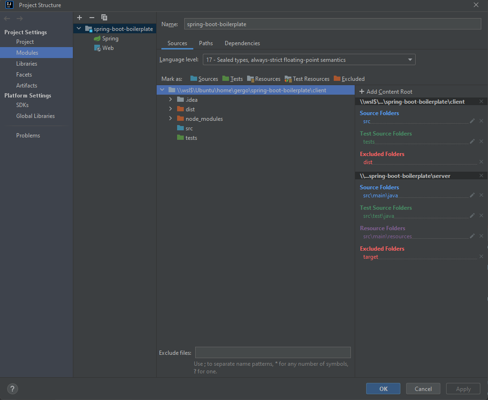

Add .env as in example to root.

Fix permissions in the WSL host:
- `chmod +x filewatcher.sh`
- `chmod +x server/mvnw`

In separate terminals:

1. `docker-compose up`
2. `./filewatcher.sh ./server/src/ 'docker-compose restart server'` to watch for changes in src
3. `docker exec -it --user node client bash` and run `npm run dev` from inside the container

Copy node_modules to host to get IDE features (also needed after installing new packages):

1. `sudo docker cp client:/app/node_modules ./client`

Fix permissions in the host for running tests from the IDE:

1. `sudo chmod -R a+rwx client/target/`
2. `sudo chmod -R a+rwx server/target/`

Use WSL git in IntelliJ

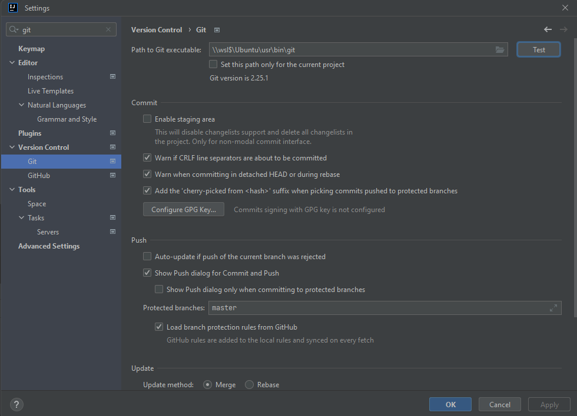

## Removing everything from Docker

1. `docker-compose down`
2. `docker system prune -a && docker volume prune`

## IntelliJ debugger config

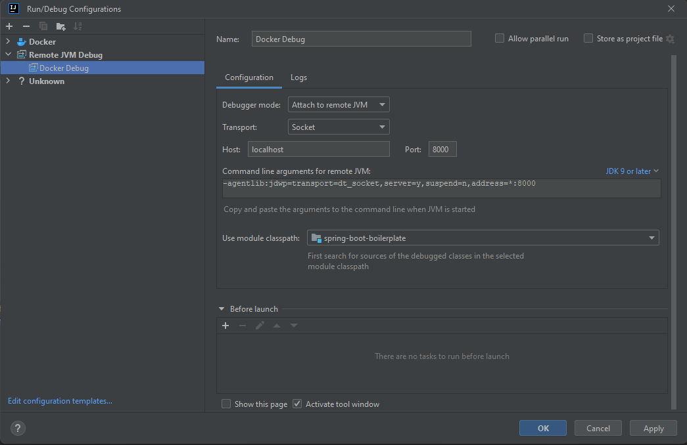

To debug, start the debugger from IntelliJ after starting the Docker environment.

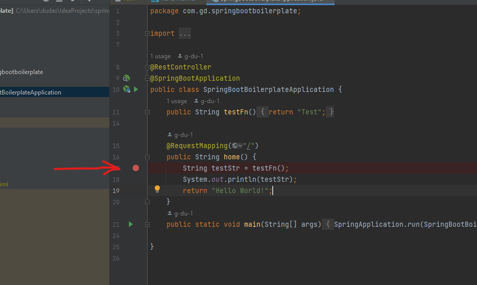

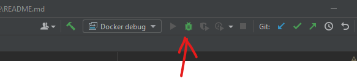

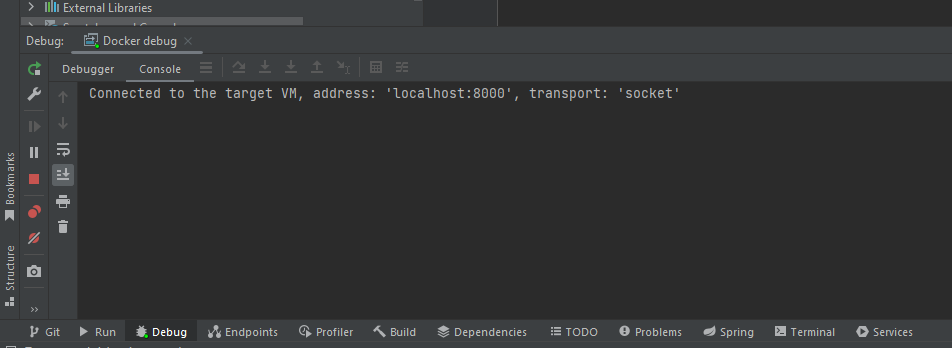

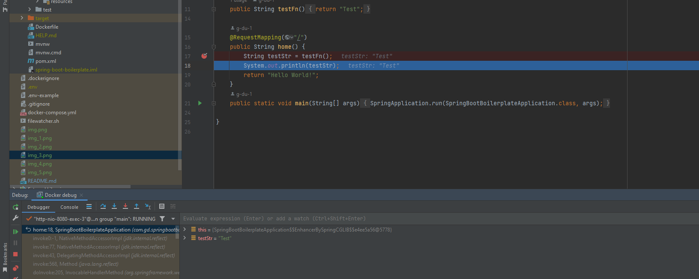

## Testing

Run tests directly from IntelliJ.

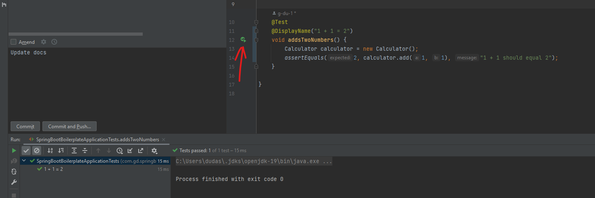

Debug tests directly from IntelliJ.

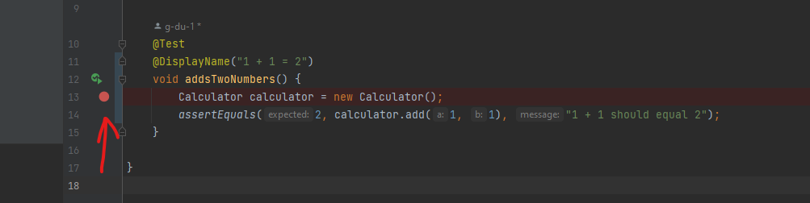

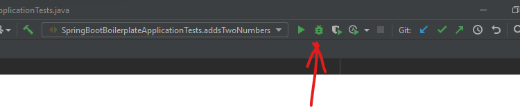

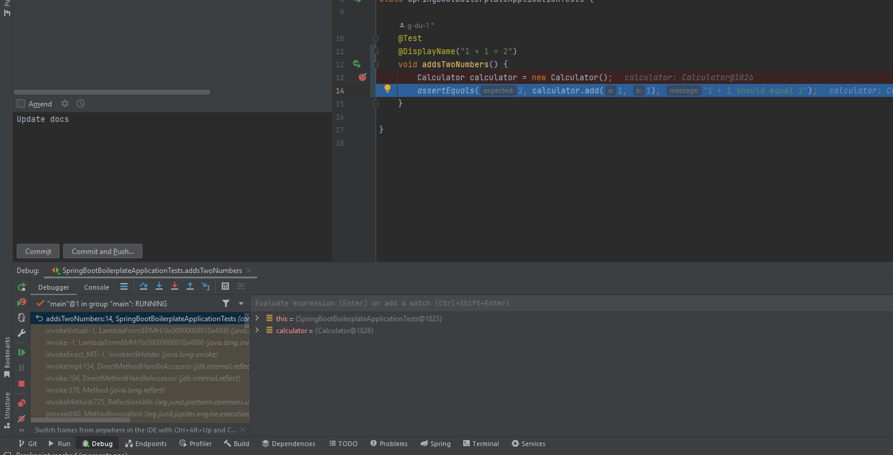

## Installing node modules inside the container

`docker exec -it --user root client bash`

## Running node commands inside the container

`docker exec -it --user node client bash`

## Running front end tests

`npm run test:watch` inside the client container (or run from IntelliJ)

## IntelliJ db config

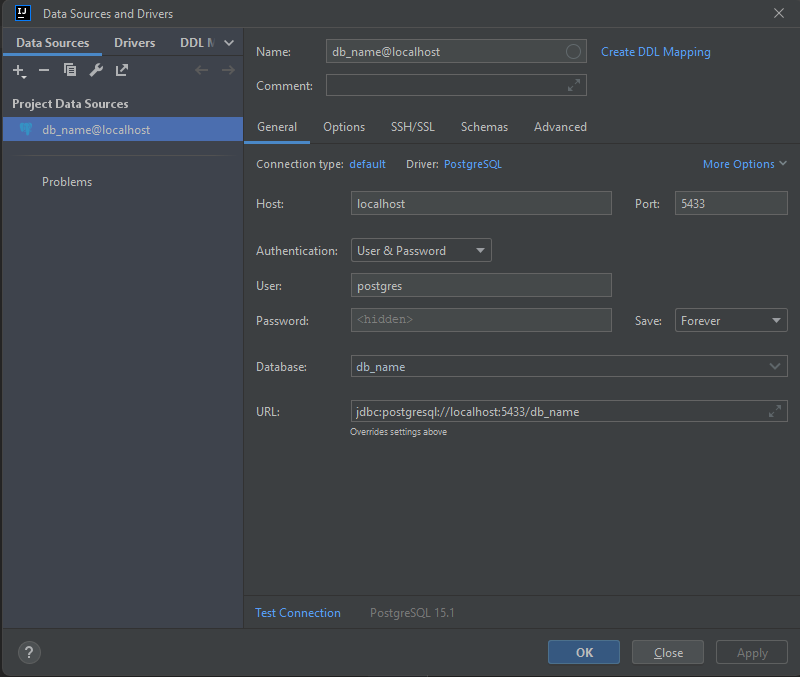

## Fixes for issues

- Open project from explorer via context menu instead of from IntelliJ
- git config --global safe.directory '*' in Windows
